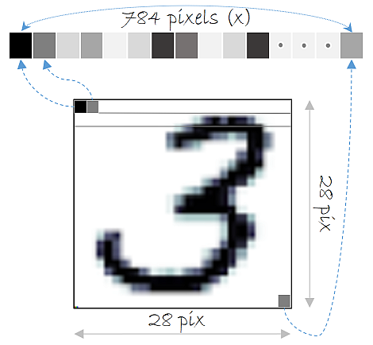
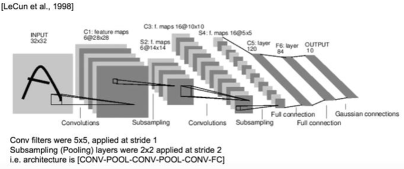

# LeNet-5
 ## LeNet-5
Fully Connected Layer (완전연결계층)을 이용해 MNIST 데이터셋을 분류하는 모델을 만들 때 3차원인 MNIST 데이터 (28, 28, 1)를 input으로 넣어주기 위해 3차원을 1차원의 평평한(flat) 데이터로 펼쳐줘야 했다. 즉, 28 * 28 * 1 = 784의 1차원 데이터로 바꾸어 입력층에 넣어줍니다.

 

이미지 데이터는 3차원의 형상을 가지며, 이 형상에는 공간적 구조(spatial structure)를 가진다. Fully Connected Layer의 문제점은 바로 데이터의 형상(topology)이 무시된단는 것입니다.  

 그래서 Local receptive field, Shared weight, Sub-sampling의 개념을 결합한 Convolutional Neural Network(CNN)를 개발합니다  

 ## LeNet-5의 구조
- **LeNet-5 구조**
 

| input - C1 - S2 - C3 - S4 - C5 - F6 - output 
 - input layer
 - conv layer (C1,C3, C5) 3개
 - subsampling layer (S2, S4) 2개
 - full-connected (F6)
 C1~F6 Layers 활성화 함수는 tanh  

- **C1 Layer**
입력 영상(32x32)을 6개의 필터(5x5)와 컨볼루션 연산을 한다. 그 결과 6장의 28x28 피쳐맵을 얻는다. 피쳐맵이 6장인 이유는 각 필터마다 피쳐맵이 나오기 때문이고, 사이즈는 32에서 28로 줄어든 이유는 패딩처리를 하지 않았기 때문이다.  

- **C2 Layer**
Average Pooling으로 Subsampling한다. 2x2 필터를 stride 2로 설정하여 Feature map이 반(14x14)으로 축소한다.   

- **C3 Layer**
결과적으로는 6장의 14x14 피쳐맵으로터 16장의 10x10 피쳐맵을 산출해낸다. 
6개의 모든 피쳐맵이 16개의 필터처리 하는 것이 아니라 다음 테이블과 같이 선택적으로 입력 영상을 선택하여 반영하였다. 그 이유는 연산량의 크기를 줄이고, 연결의 symmetry를 깨줌으로써 처음 convolution으로부터 얻은 6개의 low-level feature가 서로 다른 조합으로 섞이며 global feature로 나타나기를 기대하기 때문이다.   

- **C4 Layer**
S2와 마찬가지로 subsampling 단계이고, 10x10 피쳐맵 영상을  5x5 영상으로 만든다.   

- **C5 Layer**
16개의 5x5 영상을 받아, 5x5 kernel 크기의 convolution을 수행하기 때문에 출력은 1x1 크기의 feature map이다.  

- **F6 Layer**
Fully Connected이며 C5의 결과를 84개의 unit에 연결시킨다.   